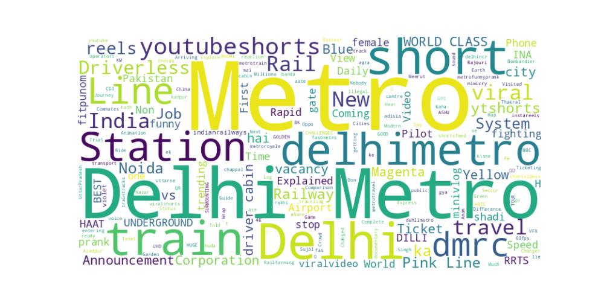
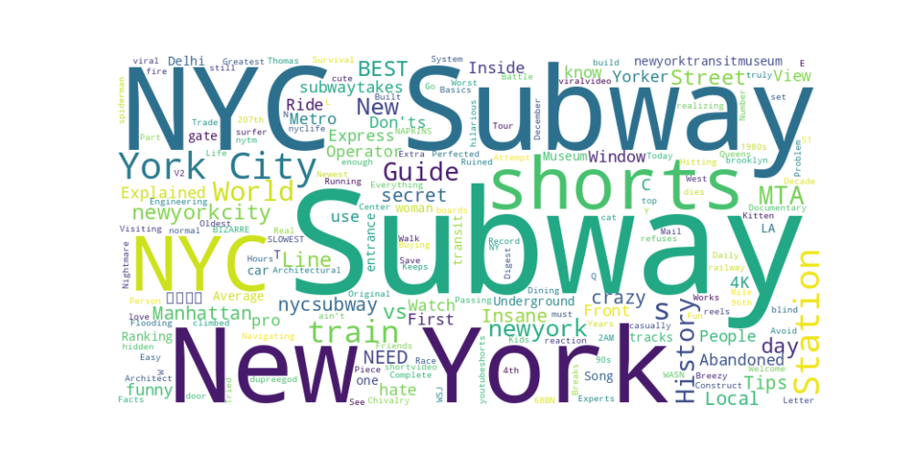
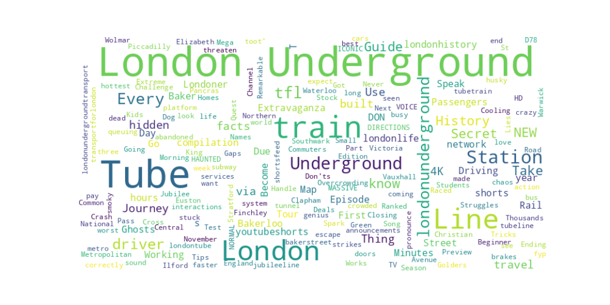
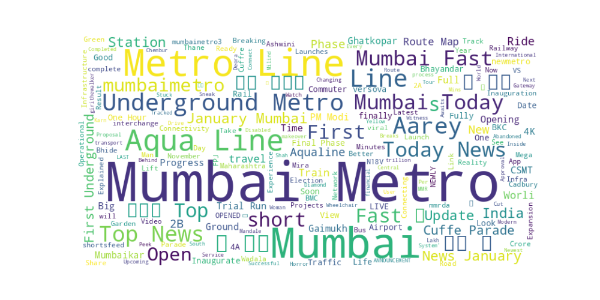
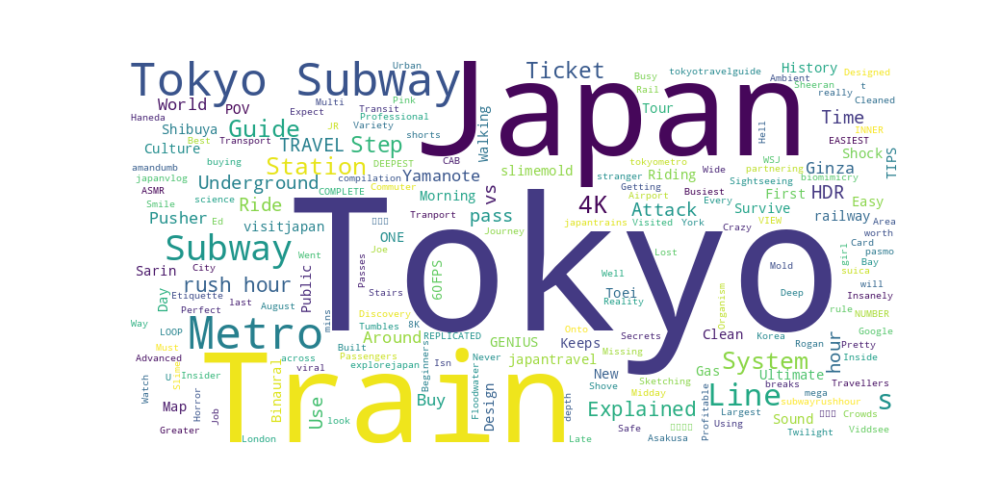

# YouTube Data Analysis: Global Public Transit Systems

## 1. Topic and Parameters (5 PTS)
**Topic:** A comprehensive comparative analysis of public transit perception across five major global urban centers.
**Parameters Used:**
* **Search 1:** Keyword: "metro rail", Location: "Delhi, IN"
* **Search 2:** Keyword: "subway", Location: "New York, USA"
* **Search 3:** Keyword: "London Underground tube", Location: "London, UK"
* **Search 4:** Keyword: "Mumbai Metro", Location: "Mumbai, IN"
* **Search 5:** Keyword: "Tokyo Subway", Location: "Tokyo, JP"

## 2. Motivation (5 PTS)
I expanded the scope of this research to five cities to gain a deeper understanding of how public transit narratives differ globally. 
1. **Delhi & Mumbai:** Represent rapidly developing systems in high-density populations, focusing on new construction.
2. **New York & London:** Represent legacy systems (100+ years old) dealing with modernization and maintenance.
3. **Tokyo:** Represents the global benchmark for efficiency and punctuality.
By comparing these five, I aim to see if the "chaos vs. order" or "growth vs. decay" narratives appear in the YouTube metadata.

## 3. Word Cloud Comparison (5 PTS)
Below are the word clouds generated from the search results.

**Word Cloud 1: Delhi Metro**

**Word Cloud 2: NYC Subway**

**Word Cloud 3: London Underground**

**Word Cloud 4: Mumbai Metro**

**Word Cloud 5: Tokyo Subway**

**Discussion:**
* **Delhi (Cloud 1):** Dominant words include "Phase," "Update," and "Review," indicating a focus on expansion and new corridors.
* **NYC (Cloud 2):** Words like "History," "Delay," and "Survive" appear often, reflecting the system's age and grit.
* **London (Cloud 3):** Terms like "Mind the Gap," "Secrets," and "Abandoned" suggest a fascination with the system's deep history and trivia.
* **Mumbai (Cloud 4):** Similar to Delhi, words like "Trial," "Line 3," and "Underground" dominate, highlighting the novelty of the new metro lines compared to the old local trains.
* **Tokyo (Cloud 5):** Words like "ASMR," "Sound," "Walking," and "Peaceful" are unique here, reflecting an appreciation for the sensory experience and efficiency of the system.

## 4. Observed Patterns and Reasons (5 PTS)
* **The "Construction" Pattern:** Both Indian cities (Delhi, Mumbai) feature heavy usage of "Update" and "Vlog." This is because the metro systems are current news events there, changing the urban landscape daily.
* **The "History/Trivia" Pattern:** London and NYC feature content about "Secrets" or "Hidden Stations." Since the systems are too old to have frequent "new opening" news, creators pivot to historical storytelling.
* **The "Experience" Pattern:** Tokyo's data is distinctively atmospheric (ASMR, 4K walks). This aligns with the global perception of Japanese transit as a refined, almost aesthetic experience rather than just a utility.

## 5. Future Improvements (5 PTS)
* **Language Translation:** The Tokyo search results likely missed Japanese-language titles. Future research should use localized Kanji search terms to get authentic local sentiment.
* **Comment Sentiment Analysis:** Analyzing the comments on the "Delay" videos in NYC vs. the "Opening" videos in Mumbai would provide a stark contrast in user sentiment (frustration vs. pride).
* **Video Duration Analysis:** Comparing the average length of videos could reveal if "Vlogs" (Delhi/Mumbai) are longer than "captured moments" (NYC/London).

## 6. Unexpected Findings (5 PTS)
The most unexpected finding was the prevalence of "ASMR" and "Sound" related terms in the Tokyo dataset. While I expected terms about efficiency, I did not anticipate that the *sound* of the trains would be a primary content category. This contrasts sharply with NYC, where the sound is often associated with noise pollution rather than relaxation.

## Data Download
You can view the raw data used for this analysis here:
* [Download Delhi Data (CSV)](assets/search-result-1.csv)
* [Download NYC Data (CSV)](assets/search-result-2.csv)
* [Download London Data (CSV)](assets/search-result-3.csv)
* [Download Mumbai Data (CSV)](assets/search-result-4.csv)
* [Download Tokyo Data (CSV)](assets/search-result-5.csv)
